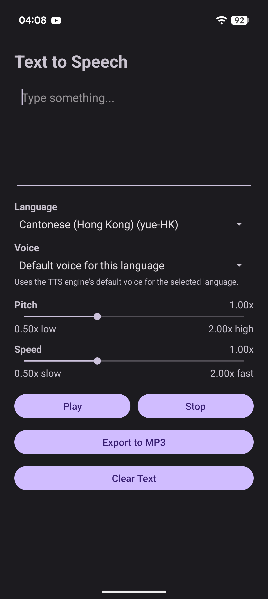
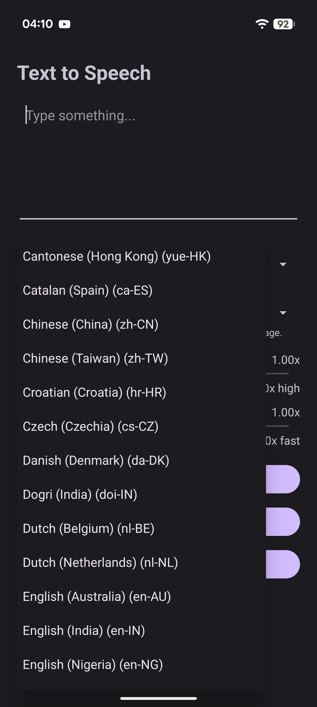
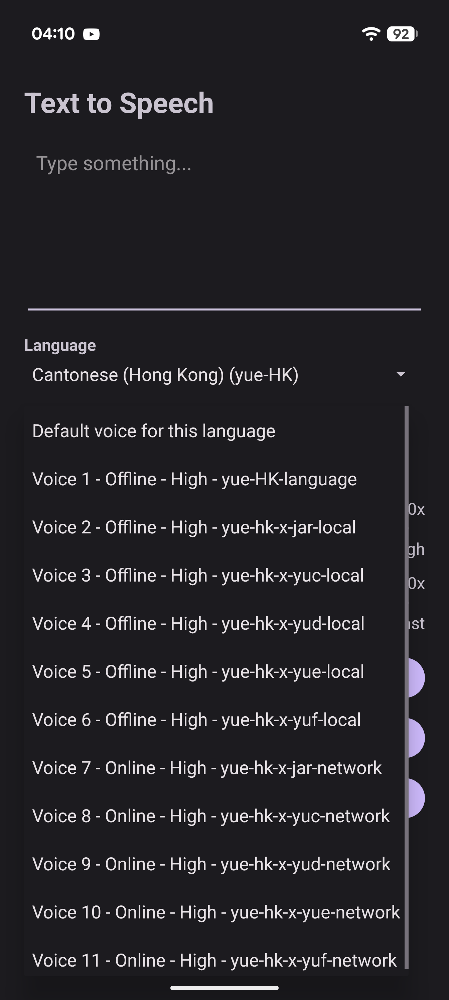

# Android Text to Speech App


A lightweight Android Text-to-Speech application built with Kotlin and Android's native `TextToSpeech` API.

The app automatically detects the languages and voices supported by the TTS engine installed on the device. Users can select a language and voice, adjust pitch and speed, play spoken text, and export the generated speech as an MP3 file.

The app also remembers the user's last selected language and restores it automatically the next time the app is opened.

---

## Features

| Feature | Supported |
|---|---|
| Text-to-Speech playback | ✅ |
| Automatic language detection | ✅ |
| Automatic voice detection | ✅ |
| Voice selection | ✅ |
| Offline / network voice indicator | ✅ |
| Voice quality information | ✅ |
| Pitch control | ✅ |
| Speech speed control | ✅ |
| Stop playback | ✅ |
| MP3 export | ✅ |
| Android system save dialog | ✅ |
| Remember last selected language | ✅ |
| Restore language after restart | ✅ |
| Status bar / display cutout support | ✅ |
| Android 7.0+ | ✅ |

---

## Screenshots


Then display them in this README with:
| Main Screen | Language Selection | Voice Selection |
|---|---|---|
|  |  |  |
| `main-screen.png` | `language-selection.png` | `voice-selection.png` |
---

## How It Works

The app uses Android's built-in:

```kotlin
TextToSpeech
```

API to detect the languages and voices available through the currently installed Text-to-Speech engine.

Unlike earlier versions, the app does not maintain a fixed list of languages.

Available languages are detected dynamically from the device.

For example, depending on the installed TTS engine, a device may provide:

```text
English (United States)
English (United Kingdom)
English (Australia)
Chinese (China)
Chinese (Taiwan)
Chinese (Hong Kong)
Japanese (Japan)
Korean (South Korea)
French (France)
German (Germany)
Spanish (Spain)
```

The exact list varies by device and TTS engine.

---

## Language Selection

Available languages come from the Android TTS engine:

```kotlin
textToSpeech.availableLanguages
```

The languages are sorted and displayed in the **Language** dropdown.

This allows the application to support additional languages automatically without requiring changes to the source code.

---

## Remember Last Selected Language

The app remembers the user's last selected language.

For example, if the user selects:

```text
Chinese (Hong Kong)
```

then closes the app, the same language will automatically be selected the next time the app starts.

The locale is saved using its language tag:

```kotlin
locale.toLanguageTag()
```

Examples:

```text
en-US
en-GB
ja-JP
zh-CN
zh-TW
zh-HK
```

Saving the locale tag instead of the dropdown position prevents the wrong language from being restored if the language list changes.

If the saved language is no longer available, the app safely falls back to the current TTS/device default.

---

## Voice Selection

Each language can provide one or more voices.

Available voices are obtained from:

```kotlin
textToSpeech.voices
```

The app filters the voices to match the currently selected language.

A voice is applied using:

```kotlin
textToSpeech.voice = selectedVoice
```

The app can also display whether a voice:

- Works offline
- Requires a network connection
- Reports normal or higher quality

The available information depends on the installed Android TTS engine.

---

## Pitch Control

Speech pitch can be adjusted from approximately:

```text
0.50x → 2.00x
```

Normal pitch:

```text
1.00x
```

The value is applied using:

```kotlin
textToSpeech.setPitch(selectedPitch)
```

Example:

```text
0.50x = Lower
1.00x = Normal
1.50x = Higher
2.00x = Very high
```

The exact sound varies between TTS engines and voices.

---

## Speech Speed

Speech speed can also be adjusted from approximately:

```text
0.50x → 2.00x
```

The value is applied using:

```kotlin
textToSpeech.setSpeechRate(selectedSpeed)
```

Example:

```text
0.50x = Slow
1.00x = Normal
1.50x = Fast
2.00x = Very fast
```

---

## Playing Speech

Before playback, the app applies the selected:

- Language
- Voice
- Pitch
- Speech speed

Speech is started using:

```kotlin
textToSpeech.speak(
    text,
    TextToSpeech.QUEUE_FLUSH,
    null,
    "speechId"
)
```

`QUEUE_FLUSH` stops any previous utterance before speaking the new text.

---

## Stop Speech

Playback can be stopped immediately with:

```kotlin
textToSpeech.stop()
```

---

## MP3 Export

The app can export synthesized speech as a real MP3 file.

The exported audio uses the currently selected:

- Language
- Voice
- Pitch
- Speech speed

Android's:

```kotlin
synthesizeToFile(...)
```

is used together with an:

```kotlin
UtteranceProgressListener
```

to generate the TTS audio.

The generated PCM audio is encoded to MP3 using:

```text
com.github.axet:lame:1.0.9
```

which provides an Android/JNI build of `libmp3lame`.

The exporter also replaces the initial placeholder VBR frame with the final LAME/Xing header to improve compatibility with standard MP3 players.

The destination file is selected through Android's Storage Access Framework, so broad storage permissions are not required.

---

## Example Text

### English

```text
Hello, how are you today?
```

### Japanese

```text
こんにちは。元気ですか？
```

### Mandarin Chinese

```text
你好，你今天好嗎？
```

### Cantonese Chinese

```text
你好，你今日好嗎？
```

### Korean

```text
안녕하세요. 오늘 어떻게 지내세요?
```

### French

```text
Bonjour, comment allez-vous aujourd'hui ?
```

### Spanish

```text
Hola, ¿cómo estás hoy?
```

---

## Chinese and Cantonese Support

Chinese pronunciation depends on the selected locale and voice.

Common Android locale tags include:

| Locale | Typical Use |
|---|---|
| `zh-CN` | Mainland China / Mandarin |
| `zh-TW` | Taiwan / Mandarin |
| `zh-HK` | Hong Kong / Cantonese when supported |

Cantonese support depends on the installed Text-to-Speech engine and available voice data.

The same Chinese characters can therefore be pronounced differently depending on the selected locale.

---

## TTS Engine Compatibility

The application works with Android Text-to-Speech engines such as:

- Google Speech Services
- Samsung Text-to-Speech
- Manufacturer-provided TTS engines
- Compatible third-party TTS engines

Different engines may provide different:

- Languages
- Accents
- Voices
- Offline voices
- Network voices
- Voice quality levels
- Pronunciation
- Pitch behavior
- Speech-rate behavior

Two Android devices running the same app may therefore show different languages and voices.

---

## Voice Tone Limitations

Android's standard TTS API supports:

- Voice selection
- Language selection
- Regional accents
- Pitch adjustment
- Speech-rate adjustment

However, Android does not provide standardized categories for every voice such as:

```text
Male
Female
Happy
Sad
Angry
Excited
Whisper
Narrator
Professional
News
Storytelling
```

Some TTS engines may provide voices with different characteristics, but Android does not expose consistent gender or emotional-style metadata across all engines.

Advanced emotional or neural voice styles would require integration with a compatible neural or cloud Text-to-Speech provider.

---

## Requirements

- Android Studio
- Kotlin
- Android SDK
- Android device or emulator
- Android Text-to-Speech engine
- Appropriate TTS voice data

Minimum SDK:

```text
Android 7.0
API Level 24
```

---

## Installation

### 1. Clone the repository

```bash
git clone https://github.com/YOUR_USERNAME/YOUR_REPOSITORY_NAME.git
```

### 2. Open in Android Studio

Open the cloned project directory in Android Studio.

### 3. Sync Gradle

Allow Android Studio to download and sync all required Gradle dependencies.

### 4. Build

Select:

```text
Build > Make Project
```

### 5. Run

Connect an Android phone or launch an emulator.

Then click:

```text
Run ▶
```

---

## Usage

1. Open the app.
2. Enter text into the text box.
3. Select a language.
4. Select a voice.
5. Adjust pitch if desired.
6. Adjust speech speed if desired.
7. Press **Play**.
8. Press **Stop** to stop playback.
9. Press **Export to MP3** to save the generated speech.
10. Choose the filename and location using Android's system file picker.
11. Press **Clear Text** to clear the input.

The selected language is automatically saved.

When the app is opened again, the previously selected language is restored if it is still available.

---

## Android Manifest

The app declares access to Android Text-to-Speech services:

```xml
<queries>
    <intent>
        <action android:name="android.intent.action.TTS_SERVICE" />
    </intent>
</queries>
```

No microphone permission is required because the application does not record audio.

Broad storage permission is not required because MP3 files are saved through Android's Storage Access Framework.

---

## Display Cutout Support

Android Window Insets are used so application content does not overlap:

- Status bar
- Navigation bar
- Front-camera cutout
- Display notch

Example:

```kotlin
val insets = windowInsets.getInsets(
    WindowInsetsCompat.Type.systemBars() or
        WindowInsetsCompat.Type.displayCutout()
)
```

---

## Project Structure

```text
app/
├── manifests/
│   └── AndroidManifest.xml
├── kotlin+java/
│   └── com.example.texttospeechapp/
│       ├── MainActivity.kt
│       └── Mp3Encoder.kt
└── res/
    └── layout/
        └── activity_main.xml
```

---

## Technologies

- Kotlin
- Android Studio
- Android XML
- Android `TextToSpeech`
- Android `Voice`
- Android `SharedPreferences`
- Android Storage Access Framework
- AndroidX Window Insets
- libmp3lame
- `com.github.axet:lame:1.0.9`

> `libmp3lame` is LGPL-licensed. Review the dependency's licensing requirements before distributing the application.

---

## Privacy

Text-to-Speech processing is performed by the TTS engine selected on the Android device.

Some voices work entirely offline.

Other voices may require an internet connection.

The app indicates network-required voices when that information is available from Android.

Users who require offline operation should select an offline TTS voice.

---

## Known Limitations

- Available languages depend on the installed TTS engine.
- Available voices vary between devices.
- Some languages require additional TTS voice data.
- Cantonese is not guaranteed to be available on every device.
- Some engines provide only one voice for a language.
- Voice quality varies by TTS engine.
- Pitch and speed behavior can vary by voice.
- Android does not provide standardized gender information for every voice.
- Android does not provide standardized emotional speaking styles.

---

## Roadmap

Possible future improvements:

- Remember the last selected voice
- Remember pitch and speed settings
- Favorite languages
- Favorite voices
- Search languages
- Search voices
- Save recent text
- Text history
- Dark mode
- Import TXT files
- Import documents
- Pause and resume speech
- Word highlighting during playback
- Suggested MP3 filenames
- Recent MP3 export history
- Multiple text presets
- Neural/cloud TTS support
- Emotional voice styles
- Additional audio export formats

---

## Version
### Version 1.1.3

- Keeps the Android soft keyboard hidden when the app first opens.
- Uses the activity soft-input setting only, avoiding startup focus manipulation.
- The keyboard still opens normally when the user taps the text box.

### v1.1.2

- Keep the Android soft keyboard hidden when the app opens.
- Prevent the text input from automatically taking keyboard focus at startup.
- The keyboard still opens normally when the user taps the text box.
- 
### v1.1.1

- Remember the user's last selected language
- Automatically restore the selected language after app restart
- Save locale language tags instead of dropdown positions
- Safely fall back when the saved language is unavailable
- Remove startup language-count notifications
- Remove unnecessary language installation notifications

### v1.1.0

- Dynamic language detection
- Dynamic voice detection
- Voice selection
- Offline/network voice information
- Voice quality information
- Pitch control
- Speech speed control
- MP3 export with selected voice settings
- TTS voice fallback support
- Improved small-screen layout

---

## License

This project uses third-party dependencies that may have their own license requirements.

In particular:

```text
com.github.axet:lame:1.0.9
```

uses `libmp3lame`, which is licensed under the LGPL.

Review all dependency licenses before publishing or distributing the application.
